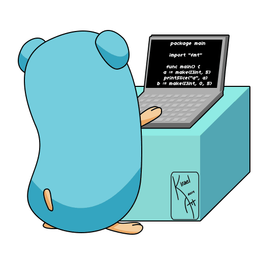

  

 

<table align="center" border="0" cellpadding="0" cellspacing="0">
  <tr>
    <td align="left" valign="top" width="400">
      
🎓 <b>Education:</b> PTIT · 4th year

      
💻 <b>Main Focus:</b> Software Engineering

      
🚀 <b>Exploring:</b> Microservices & DevOps

      
📍 <b>Location:</b> Ho Chi Minh City, Vietnam 🇻🇳

    </td>
    <td align="center" valign="middle">
      
    </td>
  </tr>
</table>

 

## 🛠️ Tech Stack

  
### Languages

### Frameworks

### Databases

### Tools

 

## 🌱 Currently Working On

- 🏗️ Building **[BotCV](https://github.com/Bot-CV)** with Microservices
- 🚀 Working on architectures using **Go, Spring Boot, and Kafka**
- 🔐 Implementing secure authentication using **JWT and OIDC**
- 🐳 Deploying services with **Docker** and exploring **DevOps** workflows
- 🌐 Managing service exposure and domains with **VPS and Cloudflare**
- 🗄️ Designing scalable database architectures

 

## 📊 Stats

  

 

  
  

  

 

## 🤝 Connect

 

   
  

    <i>"Simplicity is the soul of efficiency."</i> 
    — <b>Austin Freeman</b>
  

